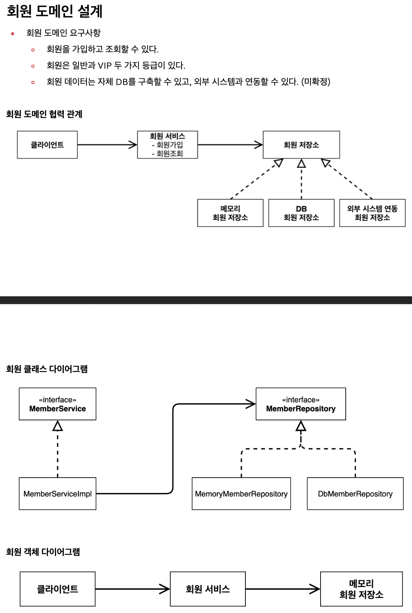
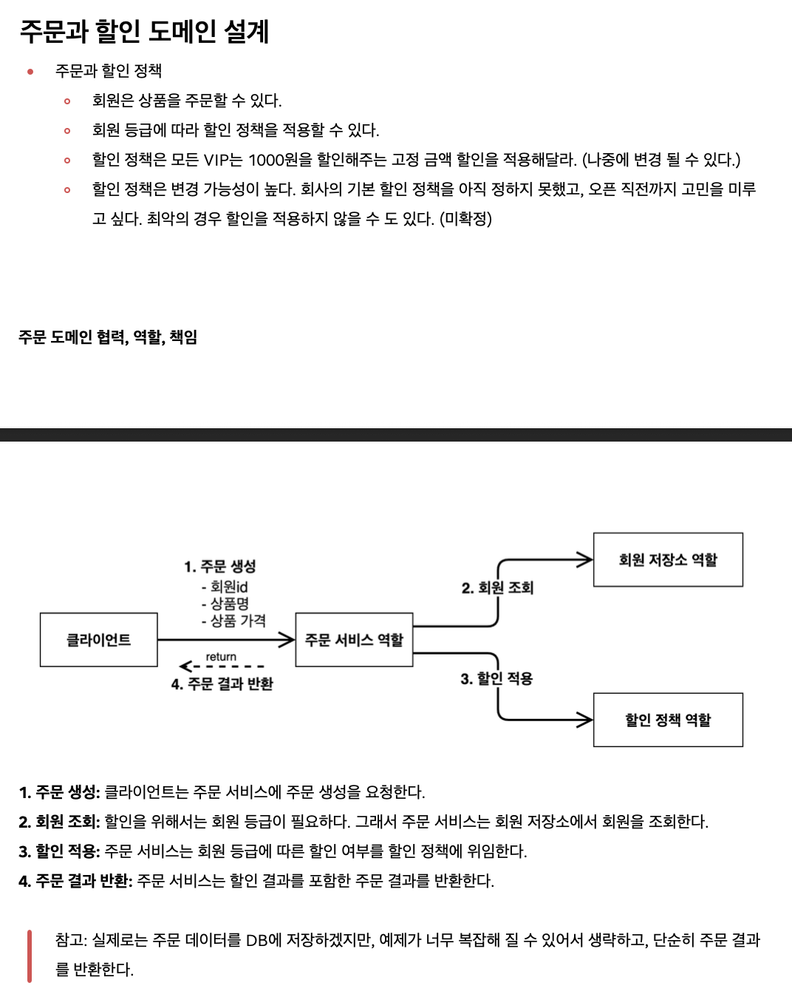
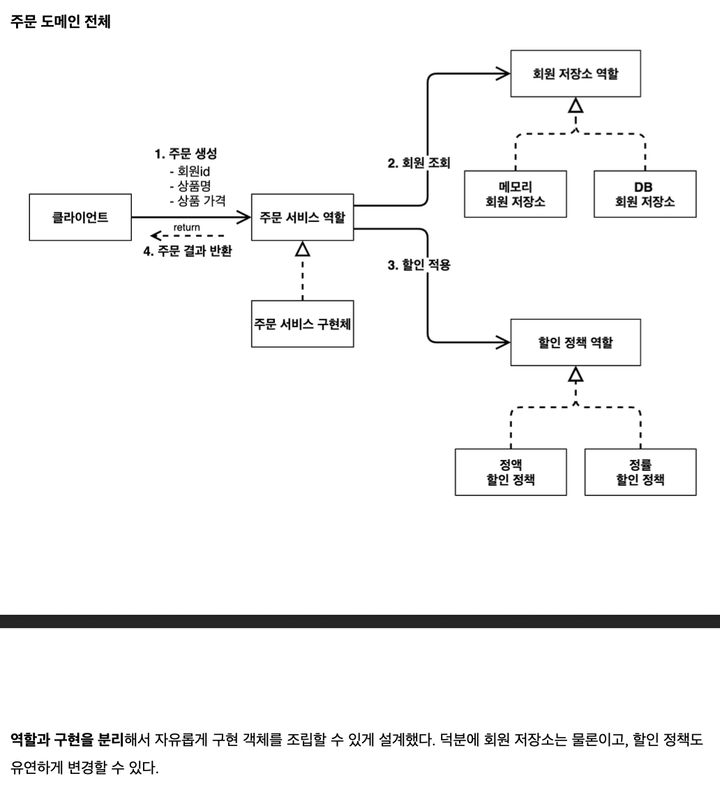
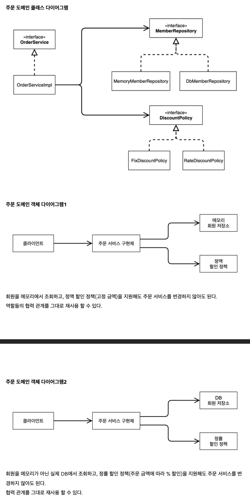
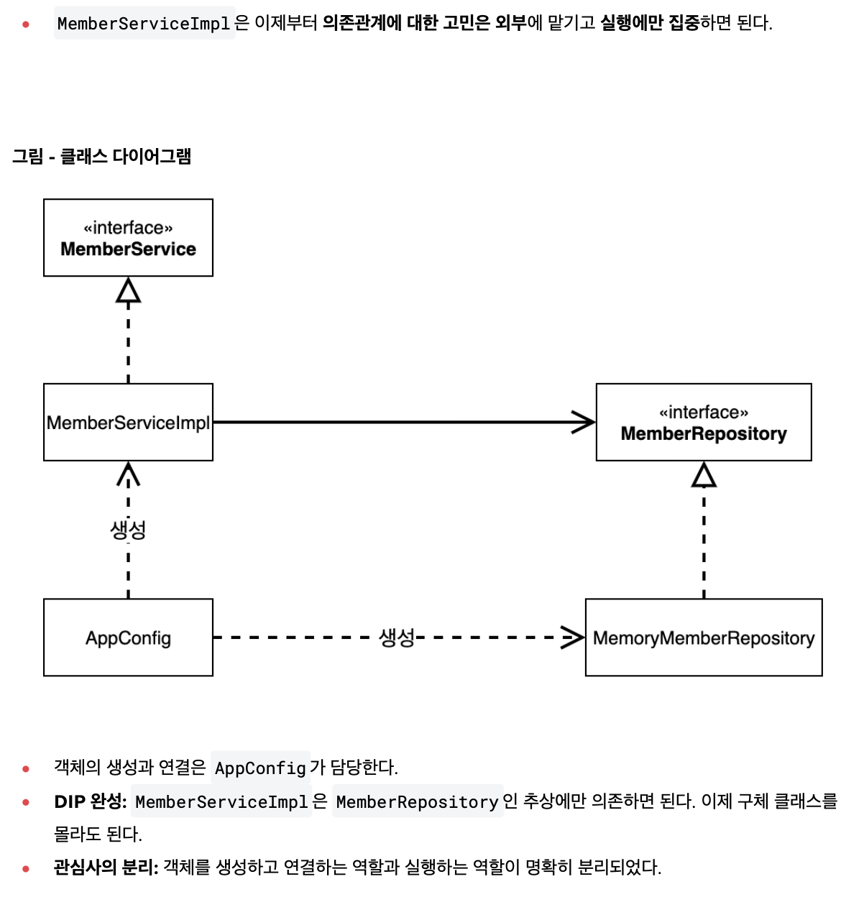
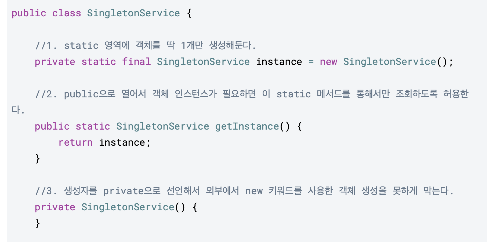

# spring-basic

## 회원-주문-할인 예제로 배우기
- ### 회원 도메인 설계

- ### 주문과 할인 도메인 설계

- ### AppConfig로 DI

- ### Spring Bean으로 DI (Refactor)
  - AppConfig.java 참고

- ### 싱글톤 컨테이너
  - "객체 인스턴스가 JVM에 하나만 존재하는 패턴"
  - why? 클라이언트가 요청 할 때마다, 새로운 인스턴스가 만들어지면 안됨.
    - 메모리 낭비
    - Garbage Collection 리소스 소요
  
  - java만으로 싱글톤 패턴을 구현하면, (아래 그림 참고) 코드가 많고 DIP 위반 (.getInstance) 
  
  - 따라서, 스프링 컨테이너를 사용하면 편함.