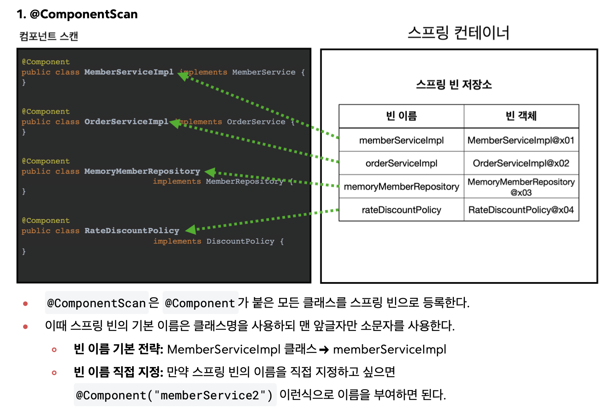
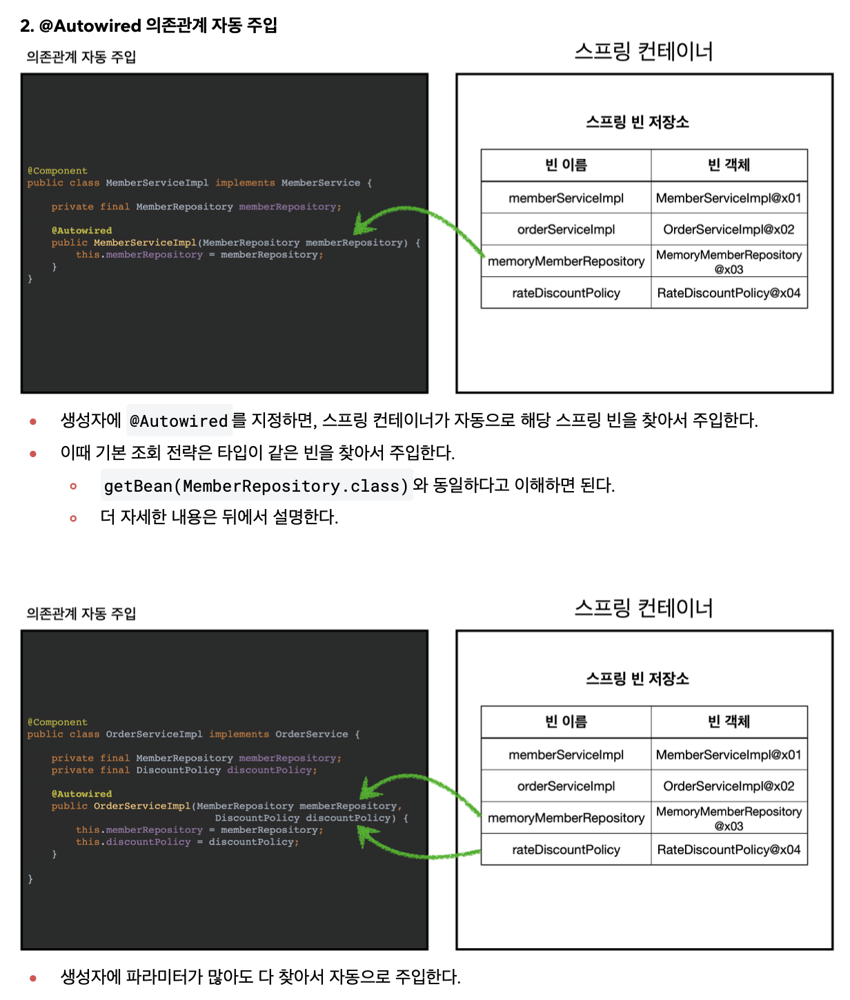

# spring-basic

## 회원-주문-할인 예제로 배우기
- ### 회원 도메인 설계

- ### 주문과 할인 도메인 설계

- ### AppConfig로 DI

- ### Spring Bean으로 DI (Refactor)
  - AppConfig.java 참고

- ### 싱글톤 컨테이너
  - "객체 인스턴스가 JVM에 하나만 존재하는 패턴"
  - why? 클라이언트가 요청 할 때마다, 새로운 인스턴스가 만들어지면 안됨.
    - 메모리 낭비
    - Garbage Collection 리소스 소요
  
  - java만으로 싱글톤 패턴을 구현하면, (아래 그림 참고) 코드가 많고 DIP 위반 (.getInstance) 
  
  - 따라서, 스프링 컨테이너를 사용하면 편함.
  - #### 싱글톤 패턴의 주의점!
    - 하나의 객체 인스턴스 공유 => "stateless" 유지해야 함!
      - 특정 클라이언트에 의존적인 필드가 있으면 안됨
      - 특정 클라이언트만 값을 변경할 수 있는 필드가 있으면 안됨
      - 가급적 읽기만 가능하게 설계
    - ##### 즉, 바로 값을 return해줘야함. 가변 인자 절대 안됨!!!
  - #### @Configuration
    - new가 여러번 호출되어도, 싱글톤을 유지되게 해줌.

- ### 컴포넌트 스캔 @ComponentScan
  - @Component 사용한 클래스를 스프링 빈에 자동 등록해줌
    - 종류
      - @Controller
      - @Repository
      - @Configuration
      - @Service
      
    
  
  - @Autowired 함께 사용. DI 위함!
  
    - 같은 타입이 빈에 여러 개 있으면 생기는 문제 -> 바로 뒤에서 설명

- ### 의존관계 자동 주입 (@Autowired)
  - #### "생성자 주입을 사용하세요!"
    - 생성자는 처음에 한 번만 호출 가능 '불변'
    - setter 주입은 public이라, 누군가 변경할 여지가 있음
    - 필드에 final 넣기가 가능함
    - 객체 생성 시, 인자로 넣을 의존관계를 넣기에 '누락방지'
    - (참고) 생성자 주입이 하나면, @Autowired 생략가능!
  
  - #### Lombok을 활용한 Annotation으로 자동 코드짜기
    - @Getter, @Setter
    - @ToString
    - @RequiredArgsConstructor
      - @Autowired 생성자를 만들어 준다.
  
  - 조회한 빈이 2개 이상인 경우
    - DiscountPolicy
      - 정액할인정책
      - 정률할인정책
    - 해결!
      - @Qualifier
      - @Primary (실무에서 자주 사용!) -> 아래 예시
        - 메인DB
        - 보조DB 
  
- ### 자동, 수동 올바른 실무 운영 기준
  - "편리한 자동기능을 기본으로 사용하자!"
    - @ComponentScan을 사용
  - 구분
    - 업무로직 빈 (컨트롤러, 서비스, 레포지토리)
      - 자동기능 사용 (관리 용이하게!)
    - 기술지원 빈 (로그, 데이터베이스 연결) / 다형성 적극활용한 업무로직 빈 (고민 필요함)
      - 수동기능 사용 (명확하게!)
      - config 이용 @Bean -> 빈들을 거시적으로 볼 수 있다는 장점

- ### 스프링 빈의 라이프 사이클
  - 스프링 컨테이너 생성
  - 스프링 빈 생성
  - 의존관계 주입 (DI)
  - **초기화 콜백**
    1. implements InitializingBean (인터페이스 활용)
      - afterPropertiesSet() 메서드 오버라이드
      - 위 메서드에 초기화 후 바로 실행하려는 기능 추가
    2. @Bean(initMethod="name")
    3. (실무에서 많이 사용) **@PostConstruct**
  - 사용
  - **소멸전 콜백**
    1. implements DisposableBean (인터페이스 활용)
      - destroy() 메서드 오버라이드
      - 위 메서드에 종료 전에 실행하려는 기능 추가
    2. @Bean(destroyMethod="name")
    3. (실무에서 많이 사용) **@PreDestroy**
  - 스프링 종료

- ### 빈 스코프
  - #### 싱글톤 스코프 (기본) / spring의 처음부터 끝까지 존재
    - "항상 같은 인스턴스를 반환"
  - #### 프로토타입 스코프
    - 싱글톤과 달리 **"항상 새로운 인스턴스를 생성해서 반환"** .getBean()마다
    - 즉, 클라이언트에 반환 후 빈을 관리하지 않는다.
    - 따라서, @PreDestroy 종료 콜백 메서드 실행이 안됨.
  - 싱글톤과 프로토타입 스코프를 같이 사용할 때 문제점
    - 프로토타입 스코프가 싱글톤 스코프에 종속되어서, 새로운 인스턴스를 생성하지 않음
    - 'ObjectProvider'로 해결 / Dependency Lookup (DL) 이라고 함
    - 만약, spring을 사용할 수 없다면, 'JSR-330 Provider'를 사용한다.
  - #### 웹 스코프
    - 대표적으로 **request 스코프**가 있음
      - http 요청이 들어오고 나갈 때까지 유지함
      - 각각의 http 요청마다, 빈 인스턴스가 생성되고 관리된다.
      - uuid를 사용하여 http요청을 구분, request 스코프 별로 로그를 관리해보자!
    - request scope를 사용하면, 필요한 http 정보들만 이쁘게 관리가 가능하다.
    - 'ObjectProvider'로 프로토타입 스코프처럼 빈의 생성을 지연시켜줘야 한다.
    - Provider 대신 Proxy를 사용하는 방법도 있다. -> 고급편의 AOP와 유사
      - 즉, 가짜 프록시 클래스를 다른 빈에 미리 주입해 두는 것
      - 실제로 http 요청이 올 때, 가짜 프록시 클래스가 진짜 myLogger에 접근하여 메서드 호출함.
    - common, web 패키지를 참고
